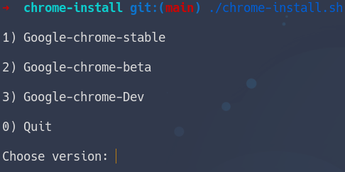

### Google Chrome install script for Solus Linux

### How to install

` git clone https://github.com/Avdushin/chrome-install `

### How to use

` cd chrome-install  `

` ./chrome-install.sh `

or

` python3 google-chrome-install.py ` 

Choose google chrome version:

